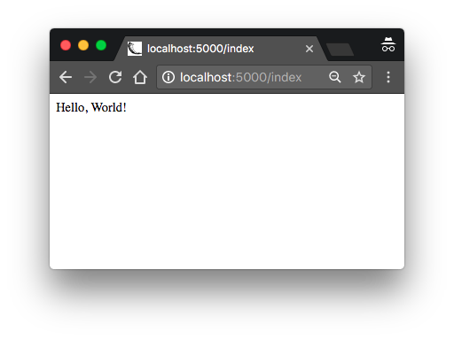

# Hello World

## TODO 前言 (1)

## 安装 Python

要做的第一件事情是安装 Python 环境。如果你的操作系统没有提供安装包，可以到[官网](http://python.org/download/)获取。如果你用的是 Windows 的
WSL 或者 Cygwin 环境，注意你要安装的 Python 不是 Windows 原生版本，而应该选择 Ubuntu (WSL) 或者 Cygwin 的版本。

要验证 Python 是否正常工作，可以打开一个 terminal 窗口，输入 `python3` 或者 `python`。正常的话应该会看到

```bash
$ python3
Python 3.5.2 (default, Nov 17 2016, 17:05:23)
[GCC 5.4.0 20160609] on linux
Type "help", "copyright", "credits" or "license" for more information.
>>> _
```

此时 Python 解释器在等待输入。在后面的章节里，你将学习到交互式命令行的各种功能。不过现在只是确认 Python 被安装好了。输入 `exit()` 回车退出
Python 命令行。或者在 Linux 或者 Mac OS X 上使用快捷键 `Ctrl-D`，Windows 上使用 `Ctrl-Z` 加回车退出。

## 安装 Flask

接下来安装 `Flask`，但在此之前先来说明一下 Python 包安装的最佳方式。

Python 的包（比如 Flask）被保存在一个公共仓库，任何人都可以下载并且安装它们。Python 官方的包仓库被称为 [PyPI](https://pypi.python.org/pypi) (Python Package Index，Python 包索引，也有人把这个仓库称作奶酪商店 (cheese shop))。

要从 PyPI 上获取并安装软件包非常容易，Python 提供了一个 `pip` 工具来完成这件事（在 Python 27 中 `pip` 尚未被打包在 Python 中需要单独的安装）。

下面的命令演示使用 pip 安装一个包

```bash
$ pip install <package-name>
```

不大多数情况上面的命令不会成功。因为当 Python 解释器被全局安装（可以被计算机上的所有用户访问），作为普通用户你是没有权限来对 Python 进行一些修改操作的，只有管理员用户才能正常安装。`pip` 工具从 PyPI 上下载包，把它添加到 Python 的安装目录中，这样所有的 Python 脚本都可以使用这个包提供的脚本。

假设你已经使用 Flask 0.11 版本来实现了自己的 web 应用。而 Flask 有了 0.12 版本，你要开发的第二个应用决定使用 0.12 版，但是升级 Flask 版本可能会影响之前的 web 应用。所以我们最好设法让第一个应用使用 Flask 0.11，而新的应用使用 Flask 0.12 版。

要解决这一问题——为不同的应用配置不同版本的包，Python 使用了 Virutal Environment （虚拟环境）的概念。Virtual Environment 是一份完整的 Python 解释器副本。当你在 Virtual Environment 中安装包时，系统级的 Python 并不受影响，只有当前副本会被修改。你可以自由为每个应用配置不同的 Python 虚拟环境。Virtual Environment 由创建者所有，因此不需要他们具有管理员权限。

现在让我们创建一个目录 `microblog` 来保存我们的工程

```bash
$ mkdir microblog
$ cd microblog
```

如果你使用的是 Python3，virtual environment 支持已经包含在其中，你可以直接创建 Virtual Environment

```bash
python3 -m venv venv
```

命令指示 Python 运行 venv 包，告诉它来创建一个名为 `venv` 的 Virtual Environment。第一个 `venv` 是 Python Virutal Environment 包的名称，第二个是要创建的 Virtual Environment 包的名称。如果你对此仍有困惑，那么你可以他第二个 `venv` 改成任何名称来表示 Virtual Environment。一般习惯会在工程目录下创建一个 `venv` 目录来作为  Virtual Environment 环境，这样切到工程目录时就能找到对应的 Virtual Environment 环境。

注意，有些操作系统中，你需要用 `python` 而不是 `python3`。不过也有一些系统的 `python` 指的是 Python 2.X 版本，`python3`表示 3.X 版本。

当命令执行完成后，将会生成一个 `venv` 目录，里面保存有 Virtual Environment 需要的文件。

如果你使用的 Python 版本低于 3.4（包括 2.7），Virtual Environment 并没有被打包在 Python 中。对这些低版本，你需要去单独下载和安装 [virtualenv](https://virtualenv.pypa.io/) 工具。安装后你可以直接用 `virtualenv` 创建 virtual environment

```bash
$ virtualenv venv
```

无论用何种方式创建好 venv，接下来你需要告知系统你要使用（激活）Virtual Environment

```bash
$ source venv/bin/activate
(venv) $ _
```

如果你使用的是 Window CMD 窗口，则需要用以下命令
```cmd
$ venv\Scripts\activate
(venv) $ _
```

激活 virtual environment 后，你的当前 terminal 会话讲使用虚拟环境中的 Python 解释器。并且命令提示符也发生了变化提醒你在虚拟环境中。Virtual Environment 仅临时并且私有的在当前会话内生效，关闭窗口自动退出。甚至在你同时打开了多个 terminal 时，可以为每个 terminal 配置使用不同的虚拟环境。

现在在虚拟环境中，我们来安装 Flask

```bash
(venv) $ pip install flask
```

如果你想确认 Flask 被安装成功，可以启动一个 Python 解释器尝试导入 Flask 包

```bash
>>> import flask
>>> _
```

上面的指令没有报错，表示 Flask 被正常安装，庆祝一下吧。

## A "Hello, World" Flask Application

[Flask 官网](http://flask.pocoo.org/) 上包含了一个五行代码的示例 WEB 应用。我不打算重复这个简单例子，而是给你一个更复杂的例子，让你对大型应用结构有更好的了解。

Application （应用）也被置于一个 Package （包）内。在 Python 中，一个包含有 `__init__.py` 文件的子目录就是一个 Package，包可以被导入 (imported)。当你导入一个包时， `__init__.py` 脚本将被执行，其中定义的符号将可以被外部访问到。

让我们创建一个 `app` 的包，其中包含有我们应用的代码。现在我们在 `microblog` 目录下建立目录 

```bash
(venv) $ mkdir app
```

新建 `app/__init__.py` 脚本，表示 Flask 应用实例

```python
from flask import Flask

app = Flask(__name__)

from app import routes
``` 


上面的脚本简单的创建了一个 Flask 类的实例，Flask 类由 flask 包中导出。传给 `Flask` 类的变量 `__name__` 是 Python 预定义的变量，表示当前模块的名称。Flask 根据这个模块的位置来确定相应的资源的目录，比如在[第二章](chapter2.md)中将会提到的 template （模块）文件。一般来说，使用 `__name__` 能适应大部分应用场景。最后我们导入了 `routes` 模块，但还没有使用到。

代码中的 `app` 实例与包 `app` 可能会令你感到迷惑。其中 `app` 包指的是 `app` 目录以及其中的 `__init__.py` 脚本，我们导入了包中的内容：`from app import routes`。而 `app` 变量是 `Flask` 类的一个实例，它也是 `app` 包中的一个成员。

另一个特殊的地方是我们在最后才导入了 `routes` 模块，而不是习惯上的在脚本开头导入。之所以要在最后导入是为了解决循环导入问题（circular imports）——这种问题在 Flask 中很常见。下面的讲解中，我们将看到  `routes` 模块中一开始导入了 `app` 变量，把相互依赖的模块中的一个的导入语句放在最后，以避免相互引用问题。

那么，`routes` 模块在哪里？Route （路由）对应于应用为不同 URL 实现的处理方法。在 Flask 中，route 的处理方法由 Python 函数表示，被称为 view functions。View function 被映射到一个或多个 URL，Flask 在收到 Client 的请求后会调用相应的处理方法。

下面是我们的第一个 view function：`app/routes.py` （主页 Route）

```python
from app import app

@app.route('/')
@app.route('/index')
def index():
    return "Hello, World!"
```

这个 view function 相当简单，只是返回了字符串 “Hello, World!" 作为问候。上面的两行 `@app.route` 被称为 decorators （装饰器）。

装饰器是 Python 语言的一个特殊语法，用来修改其装饰的函数的功能。装饰器常用于将函数注册为某种事件的回调。在这个例子中，装饰器建立了 URL 和回调函数的连接关系，URL '/' 和 '/index' 都被关联到这一函数。这表示当浏览器访问这两个 URL 时，Flask 将调用这个函数，并将返回值作为回应改善到浏览器。当然这点对当前应用意义还没那么明显。

你需要在创建一个 Python 脚本，定义 Flask 应用实例。现在创建名为 `microblog.py` 的脚本（主应用模块），其中只有一行，导入了应用实例

```python
from app import app
```

还记得我们之前区分两个 `app` 的说明吗？这里你在同一句中看到了两个 `app`。后者表示 Flask 应用实例，由 `app` 包中导出。如果你还是觉得迷惑，不妨把包名或者应用实例名改成其它名字。

再次确认一下当前的工作成果，下面是你的工程的目录结构：

```
microblog/
  venv/
  app/
    __init__.py
    routes.py
  microblog.py
```

没错，这就是你完成的第一版的 web 应用。在运行他之前，你需要设置 `FLASK_APP` 环境变量来告诉 Flask 如何运行它：

```bash
(venv) $ export FLASK_APP=microblog.py
```

如果你使用的是 Windows 系统，用 `set` 替代上面的 `export` 命令。

准备好了吗？现在来运行我们的第一个 web 应用

```bash
(venv) $ flask run
 * Serving Flask app "microblog"
 * Running on http://127.0.0.1:5000/ (Press CTRL+C to quit)
```

在服务初始化完成后，将等待客户端连接。`flask run` 的输出内容表示服务监听了 `127.0.0.1` 地址，亦即仅允许本机访问。这个地址也常常被写做 `localhost`。网络服务会监听特定的端口，一般生产环境的 web 服务会监听 443 端口或者 80 端口（非加密），但监听这些端口需要有管理员的权限。因为现在我们只是测试，Flask 使用了 5000 端口。现在打开你的浏览器来访问地址 http://localhost:5000/ 或者 http://localhost:5000/index

这两个地址实际上都指向同一个 view function，因此返回结果也是相同的，即函数的返回字符串。如果你输入其它 URL，那将会看到错误，因为我们只定义了这两个 URL 的处理方法。



按 Ctrl-C 结束服务，现在我们完成了成为 web 开发者的第一步，非常重大的一步。

在结束这一章之前，我想再强调一件事情。因为环境变量只在当前会话生效，如果每次都要为新的终端设置 `FLASK_APP` 变量会非常繁琐。从 Flask 1.0 版开始，Flask 允许你注册环境变量，这些变量将会在执行 flask 命令时自动被导入。要使用这种方式，你需要安装 `python-dotenv` 包

```bash
(venv) $ pip install python-dotenv
```

然后把环境变量写到项目根目录下的 `.flaskenv` 文件中，表示 flask 命令自动导入的环境变量

```
FLASK_APP=microblog.py
```

这一步是可选的，如果你愿意手动设置环境变量，那也由你，只要你能记得住。
