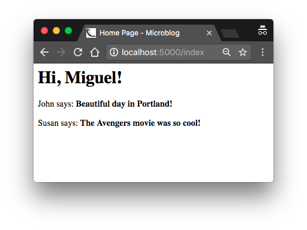
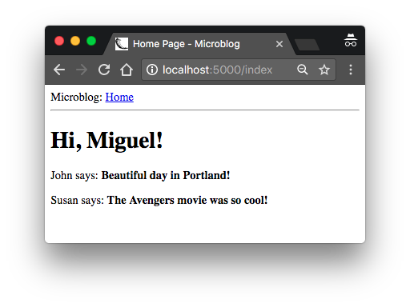

# 模板 (Template)

根据第一章的内容，我们已经实现了一个可用的简单 web 应用，它的目录结构是这样的

```
microblog\
  venv\
  app\
    __init__.py
    routes.py
  microblog.py
```

要运行这个程序，需要先设置 `FLASK_APP=microblog.py` 环境变量，然后执行 `flask run` 启动 web 服务，可以在浏览器上访问 http://localhost:5000 地址。

在本章中，我们将继续改进这一应用，学习如何优雅的生成具体复杂结构和动态内容的 web 页面。如果对于 web 服务的开发流程还有疑问的同学，可以先回顾一下 [第一章](chapter1.md) 的内容。

## 什么是模板 (Template)?

我想让我们的微博客应用 (microblogging application) 有一个标题栏用来欢迎用户。当然现在我们还没有用户这个概念，我们先假定有这样一个用户，用 Python 字典类型来表示

```python
user = {'username': "Miguel'}
```

这种模拟对象 (mock object) 可以让我们将注意力集中在应用的某一部分，而不用去完整的实现其细节，是开发中的一种常用技巧。比如我们现在关注于实现用户主页，则不需要把精力花在实现用户系统上，先定义一个用户对象来继续我们的研究。

相应的 view function 返回一个简单字符串，表示一个完整的 html 页面，如下 `app/routes.py` 所示

```python
from app import app

@app.route('/')
@app.route('/index')
def index():
    user = {'username': 'Miguel'}
    return '''
<html>
    <head>
        <title>Home Page - Microblog</title>
    </head>
    <body>
        <h1>Hello, ''' + user['username'] + '''!</h1>
    </body>
</html>'''
```

如果你对 HTML 完全不了解，我建议你先读读 wikipedia 上关于 [HTML 标记语言](https://en.wikipedia.org/wiki/HTML#Markup) 的简要介绍文章。

更新 view function 后，我们的 web 页面将会变成这样


我估计你们也看出来了，这样生成 HTML 页面不是个好方法，里面硬编码了太多的内容，如果我想要后续加入用户的博客内容，那将会有太多要改动的地方。而且应用有会有太多的 view function 来对应于这些不同的 URL，若后来有一天我想要修改应用的布局就不得不去修改每个 view function 里的 HTML 内容。也就是说这种方式非常不利于我们程序的扩展性。

如果你可以将程序的逻辑与具体的布局显示分享，事情就会简单明了得多。你可以雇用专门的网页设计师来设计一个非常专业的页面，而你的 Python 代码逻辑并不需要修改。

模板 (Template) 可以帮助你来分享展示 (Presentation) 与业务逻辑 (Business Logic）。在 Flask 中，模板被写在单独的文件中，通常保存于一个单独的模板目录中。现在我们在 microblog 项目目录中创建一个 templates 目录来保存模板

```bash
(venv) $ mkdir app/templates
```

然后我们来生成第一个模板，和之前的 view function `index()` 中返回的 HTML 几乎完全相同。主页模板 `app/templates/index.html` 内容如下

```html
<html>
    <head>
        <title>{{ title }} - Microblog</title>
    </head>
    <body>
        <h1>Hello, {{ user.username }}!</h1>
    </body>
</html>
```

这是一个标准的、最简单的 HTML 页面。里面唯一需要关注的是有几处我们使用占位符 (placeholder，用 `{{ ... }}` 包裹)。其内容将在运行时被展开成为上下文的变量内容。

这样我们就把页面的展示功能抽取出来，放在 HTML 模板中了。因此我们的 view function 实现就可以简化成渲染模板。修改后的 `app/routes.py` 文件如下

```python
from flask import render_template
from app import app

@app.route('/')
@app.route('/index')
def index():
    user = {'username': 'Miguel'}
    return render_template('index.html', title='Home', user=user)
```

现在代码清晰多了不是？试试这个新版本，它和之前的效果是一样的。在浏览器中加载了页面后你可以通过查看源码来比较 HTML 内容，看看它的原始的模板有什么不同。

通过上下文和模板生成 HTML 页面的操作我们称之为渲染 (render) 。渲染模板的函数在 Flask 框架中，名为 `render_template()` 。这一函数接收模板文件路径和一组模板变量，返回替换了占位符的渲染结果。

`render_template()` 实际上调用了 Flask 集成的 [jinja2 模板引擎](http://jinja.pocoo.org/)。由 Jinja2 来实现用模板变量对 `{{ ...}}` 的替换工作。

## 条件语句

刚才我们已经介绍了 Jinja2 通过替换占位符 (placeholders) 实现渲染页面的功能。但这不过是 Jinja2 支持的丰富的模板功能的其中之一。此外，模板还支持控制语句 `` ，这里我们来添加一个条件分支语句，如下所示是改进后的 `app/templates/index.html` 文件

```html
<html>
    <head>
        
        <title>{{ title }} - Microblog</title>
        
        <title>Welcome to Microblog!</title>
        
    </head>
    <body>
        <h1>Hello, {{ user.username }}!</h1>
    </body>
</html>
```

这样模板就有了一个新的功能：如果 view function 没有传入 `title` 变量，那么将显示默认的标题。你可以通过不给 `render_template()` 传入 `title` 参数来检查分支控制的效果。

## 循环语句

登录进来的用户想要看到最新的博客内容，现在我们来改进我们的程序来支持这一功能。

同样，我们先构造用户和博客的数据来进行测试，如下所示 `app/routes.py`

```python
from flask import render_template
from app import app

@app.route('/')
@app.route('/index')
def index():
    user = {'username': 'Miguel'}
    posts = [
        {
            'author': {'username': 'John'},
            'body': 'Beautiful day in Portland!'
        },
        {
            'author': {'username': 'Susan'},
            'body': 'The Avengers movie was so cool!'
        }
    ]
    return render_template('index.html', title='Home', user=user, posts=posts)
```

我们用 List 表示用户的博客，每个元素用一个包含 `author` 和 `body` 的字典表示。当我们来实现真正的用户管理和博客管理时，我们也需要保持这两个字段，这样我们现在用假数据设计和测试的代码依然会有效。

在模板中，我们面临的主要问题时，只有 view function 知道有多少博客需要被展示在页面上。而模板本身是不应该假设有多少博客，而需要一个通用的方法。这就是 Jinja2 中提供的 `for` 循环控制语句。

我们修改后的支持 for 循环的模板如下所示 (`app/templates/index.html`)

```html
<html>
    <head>
        
        <title>{{ title }} - Microblog</title>
        
        <title>Welcome to Microblog</title>
        
    </head>
    <body>
        <h1>Hi, {{ user.username }}!</h1>
        
        <div><p>{{ post.author.username }} says: <b>{{ post.body }}</b></p></div>
        
    </body>
</html>
```

并不困难对吧？加入几个新的博客到我们的 view function 的 post 列表中，运行一下这个新的版本，我们将看到所有的博客都被列出来了，如下图所示



## 模板继承 (Template Inheritance)

当下大多数的应用一般都会在顶部显示一个导航栏，其中包含一些常用的链接，比如个人信息、登录、退出等。我们可以在 `index.html` 模板中加入一些代码来实现这种功能。但是有个问题，当我们的应用变得复杂后，我们想要给不同的页面都加上这样的导航栏，显然重复来为每个 HTML 模板加上导航代码太繁琐了。编程有一个共识：避免重复 (it is a good practice to not repeat yourself if that is possible)

Jinjia2 有一个特征称作 template inheritance （模板继承）。简单的说，我们可以把每个模板中需要用到的公共部分提取到一个单独的基本模板中，让所有的模板都继承它。

现在我们来定义一个 `bash.html` 作为基本模板，其中包含了一个基本的导航栏，基本就是我们之前的 `index.html` 的内容。如下是 `app/templates/base.html` 代码

```html
<html>
    <head>
      
      <title>{{ title }} - Microblog</title>
      
      <title>Welcome to Microblog</title>
      
    </head>
    <body>
        <div>Microblog: <a href="/index">Home</a></div>
        <hr>
        
    </body>
</html>
```

在这个模板中，我们使用了 `block` 控制语句，定义了继承的子模板将被插入的位置。Block 需要赋予一个唯一名字，这样每个子模板可以通过这个名字来引用自己。

有了基本模板，我们可以简化 `index.html` 的实现，让它继承 `base.html`，代码如下所示

```html



    <h1>Hi, {{ user.username }}!</h1>
    
    <div><p>{{ post.author.username }} says: <b>{{ post.body }}</b></p></div>
    

```

这样 `base.html` 模板来负责全局的页面总局，`index.html` 只需要负责内容部分。`extends` 语句建立了与基本模板的联系，这样 Jinja2 会将 `index.html` 内部混合到 `base.html`。这两个模板中有同名的 `block` 对象 `content`，Jinja2 将之一起渲染。如果我们需要创建更多的页面，我们同样可以继承 `base.html` 模板，不同的页面共享样式和布局，不会有代码的重复。


