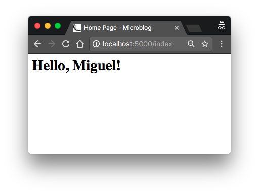

# 模板 (Template)

根据第一章的内容，我们已经实现了一个可用的简单 web 应用，它的目录结构是这样的

```
microblog\
  venv\
  app\
    __init__.py
    routes.py
  microblog.py
```

要运行这个程序，需要先设置 `FLASK_APP=microblog.py` 环境变量，然后执行 `flask run` 启动 web 服务，可以在浏览器上访问 http://localhost:5000 地址。

在本章中，我们将继续改进这一应用，学习如何优雅的生成具体复杂结构和动态内容的 web 页面。如果对于 web 服务的开发流程还有疑问的同学，可以先回顾一下 [第一章](chapter1.md) 的内容。

## TODO What Are Tempaltes? (1.7/3.8) larry

我想让我们的微博客应用 (microblogging application) 有一个标题栏用来欢迎用户。当然现在我们还没有用户这个概念，我们先假定有这样一个用户，用 Python 字典类型来表示

```python
user = {'username': "Miguel'}
```

这种模拟对象 (mock object) 可以让我们将注意力集中在应用的某一部分，而不用去完整的实现其细节，是开发中的一种常用技巧。比如我们现在关注于实现用户主页，则不需要把精力花在实现用户系统上，先定义一个用户对象来继续我们的研究。

相应的 view function 返回一个简单字符串，表示一个完整的 html 页面，如下 `app/routes.py` 所示

```python
from app import app

@app.route('/')
@app.route('/index')
def index():
    user = {'username': 'Miguel'}
    return '''
<html>
    <head>
        <title>Home Page - Microblog</title>
    </head>
    <body>
        <h1>Hello, ''' + user['username'] + '''!</h1>
    </body>
</html>'''
```

如果你对 HTML 完全不了解，我建议你先读读 wikipedia 上关于 [HTML 标记语言](https://en.wikipedia.org/wiki/HTML#Markup) 的简要介绍文章。

更新 view function 后，我们的 web 页面将会变成这样




## TODO Conditional Statements (0/0.7)

## TODO Loops (0/2.5)

## TODO Template Inheritance (0/2.3)
