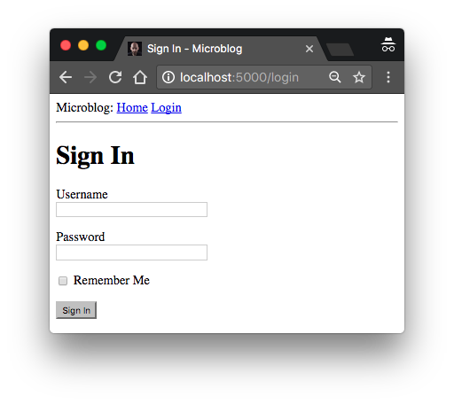

# Web 表单

在[第二章](chapter.md)中，我们创建了模板来生成应用的主页，其中的用户对象和博客对象是我们伪造的数据。在本章中我们来处理应用中的另一个重要问题：如何来接受用户提交的表单数据。

Web 表单 (Web Form) 是 Web 应用的重要组成部分。我将会演示如何通过 Web 表单来支持用户提交新的博客以及登录到应用。

在开始这一章这前，确保你已经完成了我们在前面章节完成的应用代码并且可以正常运行

## Flask-WTF 简介

要处理 Web 表单数据，我们准备使用 [Flask-WTF](http://packages.python.org/Flask-WTF) 扩展，该扩展是对 [WTForms](https://wtforms.readthedocs.io/) 包的一个轻量级封装和对 flask 的集成。这是我要演示的第一个扩展，但不是最后一个。扩展 (Extensions) 是 Flask 生态系统中的非常重要的部分，它们补足了 Flask 没有涉及的一些解决方案。

Flask 扩展也是普通的 Python 包，可以通过 `pip` 来安装，如下演示了在虚拟环境中安装 Flask-WTF 的命令

```bash
(venv) $ pip install flask-wtf
```

## 配置

到目前我们的应用还是相对简单的，我们暂时还没有关注配置 (Configuration) 的问题。一旦涉及到更复杂的问题，就需要通过一系列的配置来使 Flask 及其扩展实现更灵活的功能。

为应用程序提供配置选项有多种方式。最基本的办法是将键值对存储在 `app.config` 字典对象中。例如

```python
app = Flask(__name__)
app.config['SECRET_KEY'] = 'you-will-never-guess'
# ... add more variables here as needed
```

虽然这种语法可以提供配置，但我还是建议遵守“关注点分离”原则 (the principle of separation of concerns)，不要把所有的配置放在一起。我可以采用更复杂一些的方法，把我们的配置放在不同的文件中。

我建议使用类来存储配置，这种方式比较容易扩展，可以把配置按类组织成 Python 模块。下面是我改进后的配置类，保存在项目根目录下的 `config.py` 文件，包含有 `Secret Key` 配置

```python
import os

class Config(object):
    SECRET_KEY = os.environ.get('SECRET_KEY') or 'you-will-never-guess'
```

很简单不是？配置被定义成 `Config` 类成员变量。其它变量也可以依样添加到这个类中，如果后面我需要不止一组配置集时，我可以继承实现 `Config` 的子类。当然现在我们不用这么做。

`SECRET_KEY` 变量是 Flask 应用的一个重要配置。Flask 和它的一些扩展使用这个 SECRET KEY 用于加密、生成签名或令牌（tokens）。Flask-WTF 扩展使用 SECRET KEY 来保护 Web Form 来免受 [跨站请求伪造(Cross-Site Request Forgery, CSRF)](http://en.wikipedia.org/wiki/Cross-site_request_forgery) 的攻击。因为这个变量是私密的，生成的令牌或是签名的安全性都依赖于它，要确保不会有不可信的人或者应用获得这一密码。

我们设定 SECRET_KEY 时使用了 `or` 语句，表示首先我们尝试使用环境变量 `SECRET_KEY`，如果没有环境变量，则使用硬编码的字符串。这种优先使用环境变量，提供硬编码配置作为备用的方式在开发中很常见。在开发过程中，我们对安全性的要求并不那么高，这样我们可以使用默认的硬编码值。当真实部署到生产环境时，我们可以为每个环境设置不同的密码以确保安全性。

现在我们有了配置文件，我们要告诉 Flask 加载并使用它。可以通过 `app.config.from_object()` 方法来实现，如下 `app/__init__.py` 所示

```python
from flask import Flask
from config import Config

app = Flask(__name__)
app.config.from_object(Config)

from app import routes
```

从 `config` 中导入 `Config` 需要留意一个，正如我们从 `flask` 包中导入 `Flask` 类。小写的 `config` 表示 Python 模块 _config.py_ ，而大写的 C 表示 Config 类。

`app.config` 的配置项可以像字典元素一样被访问。这里我们在 Python 解释器进行验证

```python
>>> from microblog import app
>>> app.config['SECRET_KEY']
'you-will-never-guess'
```

## 用户登录表单

Flask-WTF 扩展使用 Python 类来表示 Web 表单。一个 Form 类基本就是把定义了类成员变量的普通类。

记着我们的关注点分离原则，我现在要定义一个新的 `app/forms.py` 模块来存储我们的 Web 表单类。用户登录时需要提供用户名和密码，此外表单还会有一个“记住登录状态”的选项以及一个“提交”按键

```python
from flask_wtf import FlaskForm
from wtforms import StringField, PasswordField, BooleanField, SubmitField
from wtforms.validators import DataRequired

class LoginForm(FlaskForm):
    username = StringField('Username', validators=[DataRequired()])
    password = PasswordField('Password', validators=[DataRequired()])
    remember_me = BooleanField('Remember Me')
    submit = SubmitField('Sign In')
```

大多数的 Flask 扩展都以 `flask_<name>` 来命名，这里 Flask-WTF 的名称就是 `flask_wtf` ，我们从中导入了基类 `FlaskForm`

用来表示成员类型的四个类直接由 WTForms 包导入，Flask-WTF 扩展并不支持自定义类型。对于 `LoginForm` 类的每个成员变量被限制为某种类型，并配置了标签名（或者描述信息）。

有的变量中传入了第二个可选参数 `validators`，其中 `DataRequired` 用来验证该表单项不为空。验证函数有很多，后面我们还会在其它表单项中用到。

## 表单模板 (Form Templates)

接下来我们需要把表单嵌入到 HTML 模板中来生成页面。一个好消息是我们定义在 `LoginForm` 中的成员变量可以被自动生成 HTML 内容，这样我们要作的事情就很简单了。下面你将看到我们的登录模板代码，我们把它保存在 `app/templates/login.html` 文件

```html



    <h1>Sign In</h1>
    <form action="" method="post" novalidate>
        {{ form.hidden_tag() }}
        <p>
            {{ form.username.label }}<br>
            {{ form.username(size=32) }}
        </p>
        <p>
            {{ form.password.label }}<br>
            {{ form.password(size=32) }}
        </p>
        <p>{{ form.remember_me() }} {{ form.remember_me.label }}</p>
        <p>{{ form.submit() }}</p>
    </form>

```

我们继承了（`extends`）[第二章](chapter2.md)里定义的 `base.html` 基本模板，来保证页面顶部有一个通用样式的导航栏。

这个模板需要使用 `LoginForm` 生成 `form` 对象来提供参数，用户的输入将被发送到相应的 view function 中，目前我们还没有实现。

HTML 的 `<form>` 元素中包含了我们的 Web 表单。其中 `action` 属性指示了浏览器在进行提交时应该使用的 URL，当设置为空时默认使用当前 URL 地址（当前页面）。`method` 方法表示使用何种 HTTP 请求方法，默认方式为 `GET`，不过大多数时间我们选择 `POST` 方法，因为它把用户提交的数据包含在请求内容中，而非像 GET 一样添加在 URL 中。`novalidate` 告诉浏览器不要对表单的内容进行验证，而是交给 Flask 服务来验证。使用 `novalidate` 是可选的，我们先这样设置，这样我们可以测试服务端的验证功能。

`form.hidden_tag()` 生成了一个隐藏的元素，其中包含了用于防止 CSRF 攻击的令牌信息。我们要做是确保引入这一隐藏元素，并且在 Flask 配置中定义 `SECRET_KEY` 变量，其它的都由 Flask-WTF 扩展来完成。

如果你曾经写过 HTML Web 表单，你会奇怪在模板中我们没有为每个表单项加入 HTML 标签。这是因为我们的 form 对象知道如何生成 HTML 标签。我们要做的只是引入 `{{ form.<field_name>.label }}` 来插入标签名，引入 `{{ form.<field_name>() }}` 来生成表单项。要为 HTML 标签添加属性，我们只需要把它们当成参数传入即可。例如上面的用户名和密码我们传入了 `size` 参数，用被添加到 HTML 的 `<input>` 标签属性中。同样，你的 CSS Class 或者 ID 设置也可以这样做。

## 表单 View Function

显示表单页的最后一步是定义一个新的 view function，以渲染模板生成页面。

我们来写这个 view function，将之映射到 `/login` URL 上。代码保存于 `app/routes.py`

```python
from flask import render_template
from app import app
from app.forms import LoginForm

# ...

@app.route('/login')
def login():
    form = LoginForm()
    return render_template('login.html', title='Sign In', form=form)
```

通过从 forms.py 中导入 `LoginForm` 类，实例化生成 `form` 对象，将之传递给 form 关键字参数。这就是我们渲染表单需要的全部操作。

为了方便登录，我们为导航栏添加一个登录的链接。修改后的 `app/templates/base.html` 代码如下

```html
<div>
    Microblog:
    <a href="/index">Home</a>
    <a href="/login">Login</a>
</div>
```

现在运行我们的服务，在浏览器中访问 http://localhost:5000 ，点击导航栏的 `Login` 链接就可以看到登录页面了。帅吧！



## 获取表单数据

在浏览器点击提交按键后，浏览器会显示 "Method Not Allowed" 错误。这是因为我们之前的登录 view function 只完成了一半工作。它只定义了表单的生成，还没有定义数据提交的处理逻辑。Flask-WTF 扩展同样也简化了这部分的工作。下面是我们改进 view function 后的代码 `app/routes.py`，其中添加了验证和接受表单提交请求。

```python
from flask import render_template, flash, redirect

@app.route('/login', methods=['GET', 'POST'])
def login():
    form = LoginForm()
    if form.validate_on_submit():
        flash('Login requested for user {}, remember_me={}'.format(
            form.username.data, form.remember_me.data))
        return redirect('/index')
    return render_template('login.html', title='Sign In', form=form)
```

首先我们在 route 装饰器上添加了 `methods` 参数，告诉 Flask 这个 view function 可以接收 `GET` 和 `POST` 请求（默认 Flask 只接受 `GET` 请求）。在 HTTP 协议中，`GET` 方法用于客户端（浏览器）请求数据，目前我们所有的方法都是 `GET`。而 `POST` 通常由浏览器提交数据到服务端（实际上 `GET` 请求也可以提交数据，但不是一个好的方式）。"Method Not Allowed" 错误正是因为浏览器发送的 `POST` 请求不被 Flask 认可。通过添加 `methods` 参数，我们允许了对这个 URL 的 `POST` 请求。

`form.validate_on_submit()` 方法完成了表单的处理工作。当浏览器首次 `GET` 方式请求页面时，这一方法返回 `False`，于是跳过这段代码，直接执行最后的渲染代码。

用户点击提交后，浏览器发送 `POST` 请求，`form.validate_on_submit()` 将收集用户提交的数据，根据我们指定的验证方法来加以校验，如果正常的话返回 `True`，表示数据一切正常。任何错误都将导致返回 `False`，这样将重新渲染表单页面，让用户重新登录，和之前的 `GET` 方法一样。随后我们还会给这个页面添加错误信息，来提示错误原因。

当 `form.validate_on_submit()` 返回 `True` 后，`login` 函数调用了两个由 `Flask` 中导入的新函数。其中 `flash()` 函数用于返回一条消息给用户 。许多应用都会使用这一方法来告知用户操作成功与否。在这里我们仅仅将这作为一种临时方法，因为我们还没有真正涉及到用户登录功能。目前我们做的只是返回一条信息告诉浏览器登录成功。

第二个新函数是 `redirect()` 函数，它的作用是使浏览器自动跳转到其它页面（`/index`），这样在登录成功后，我们将跳转到首页。

当你调用 `flash()` 函数时， Flask 会保存这条消息，但是真正的消息不会自动出现在页面上。我们需要在基础模板上添加一块新的内容来渲染这条消息，这样在所有的页面都能看到。修改后的带有 flash 消息的基础模板代码 `app/templates/base.html` 如下所示

```html
<html>
    <head>
        
        <title>{{ title }} - microblog</title>
        
        <title>microblog</title>
        
    </head>
    <body>
        <div>
            Microblog:
            <a href="/index">Home</a>
            <a href="/login">Login</a>
        </div>
        <hr>
        
        
        <ul>
            
            <li>{{ message }}</li>
            
        </ul>
        
        
        
    </body>
</html>
```

我们用到了 `with` 构造器来将 `get_flashed_messages()` 返回的内容保存在 `messages` 变量中，该变量仅在模板的这部分上下文内生效。`get_flashed_messages()` 函数来自于 Flask，返回了由 `flash()` 函数注册的全部消息。后面的条件判断检查是否有消息存在，如果有则以无序号列表（ `<ul>` ）方式列出每条消息（`<li>`）。用列表来显示消息并不美观，后面我们会来修改默认样式。

注意：被 `get_flashed_messages()` 读取的消息将从消息列表中移除，因此只有重新 `flash()` 的消息才会被再次显示。

又到了验证奇迹的时候了，填好你的用户名和密码并提交，看看 `DataRequired` 验证器是如何阻止提交操作的。

## 改进表单项验证

表单项中指定的验证器将阻止不合法的输入。对于不合法的输入，应用将会重新渲染表单，并且给用户足够的错误信息反馈。

如果你试过提交不合法的输入，我相信你一定注意到验证器确实在起作用，但是没有提示信息来表明什么地方出错是了，仅仅是重新渲染了初始表单。下一步我们需要提升用户体验，为表单添加一个验证错误的提示信息说明。

事实上，表单的验证器已经包含了错误原因，我们只需要添加额外的处理逻辑，好让模板可以把它们展示出来。

这里在登录模板中，我们为用户名和密码两个表单项添加验证错误信息栏。如下所示是我们修改后的 `app/templates/login.html` 代码

```html



    <h1>Sign In</h1>
    <form action="" method="post" novalidate>
        {{ form.hidden_tag() }}
        <p>
            {{ form.username.label }}<br>
            {{ form.username(size=32) }}<br>
            
            <span style="color: red;">[{{ error }}]</span>
            
        </p>
        <p>
            {{ form.password.label }}<br>
            {{ form.password(size=32) }}<br>
            
            <span style="color: red;">[{{ error }}]</span>
            
        </p>
        <p>{{ form.remember_me() }} {{ form.remember_me.label }}</p>
        <p>{{ form.submit() }}</p>
    </form>

```

我们在 username 和 password 表单的最后添加了 for 循环，并将验证错误信息以红色显示出来。任何表单项的验证错误信息都被存放于 `form.<field_name>.errors` 列表中（因为同一个表单项可能有多个验证器，会检查出多个问题）。

这次你如果提交了空的用户名和密码，你将看到列友好的错误提示消息，如下图所示：


## 生成链接

登录功能基本上完成了，在本章的最后我想来讨论下如何优雅的生成导航栏模板中的链接地址，以及如何进行重定向。到现在我们已经在导航栏中添加了两个链接地址了

```html
    <div>
        Microblog:
        <a href="/index">Home</a>
        <a href="/login">Login</a>
    </div>
```

登录的 view function 只通过 `redirect()` 方法跳转到主页

```python
@app.route('/login', methods=['GET', 'POST'])
def login():
    form = LoginForm()
    if form.validate_on_submit():
        # ...
        return redirect('/index')
    # ...
```

这里有一个问题，我们把链接地址硬编码到模板文件和 python 源码两个位置，如果有一天你想要修改链接地址，就需要同时修改两个地方。

要解决这一问题，Flask 提供了一个函数叫做 `url_for()`，可以根据内部映射规则生成 URL 地址。比如 `url_for('login')` 返回 `/login`，而 `url_for('index')` 返回 `/index`。`url_for()` 的参数称为 endpoint name，表示 view function 的名称。

你可能会奇怪，为什么使用函数名要比直接使用 URL 好。事实上 URL 比函数名更容易被修改。而且我们后面会讲到，一些 URL 中包含有动态元素，需要将一些元素拼接到地址中生成 URL，如果直接写 URL 地址既复杂又易出错，还是让 `url_for()` 来生成这些复杂 URL 地址吧。

这样，我们修改 `app/templates/base.html` 模板，使用 `url_for()` 来生成应用的 URL 地址，如下所示

```html
    <div>
        Microblog:
        <a href="{{ url_for('index') }}">Home</a>
        <a href="{{ url_for('login') }}">Login</a>
    </div>
```

修改 `app/routes.py` 使用 `url_for()` 来完成跳转

```python
from flask import render_template, flash, redirect, url_for

# ...

@app.route('/login', methods=['GET', 'POST'])
def login():
    form = LoginForm()
    if form.validate_on_submit():
        # ...
        return redirect(url_for('index'))
    # ...
```
