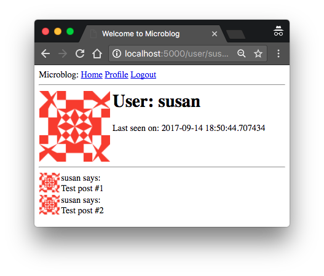
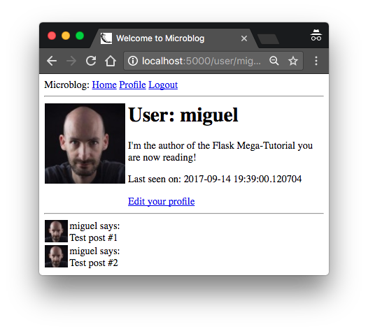

# 个人信息页 (Profile Page) 和 Avator 图标

在本章我们将专注于实现用户个人信息页(Profile)。个人信息页包含了用户个人信息。我将演示如何动态地为每个用户生成信息页，并添加一个编辑器让用户可以自行修改其信息内容。

## 个人信息页

要实现一个用户信息页，先来实现一个新的 view function 映射到 _/user/<username>_ URL，如下 `app/routes.py` 所示

```python
@app.route('/user/<username>')
@login_required
def user(username):
    user = User.query.filter_by(username=username).first_or_404()
    posts = [
        {'author': user, 'body': 'Test post #1'},
        {'author': user, 'body': 'Test post #2'}
    ]
    return render_template('user.html', user=user, posts=posts)
```

`@app.route` 装饰器与之前的不太一样，我们在里面使用了动态元素 `<username>` （动态元素被包裹在 `<` 和 `>`）中。Flask 允许在动态元素位置填写任何字符串，调用 view function 时，将传入实际元素作为参数。比如，客户端请求 `/user/susan` 地址，view function 中的参数 `username` 被设置为 `'susan'`。该 view function 只允许登录用户访问，因此我们还加上了 `@login_required` 装饰器（来自 Flask-Login）。

函数本身实现相当简单，我们首先从数据中查询用户信息。之前我们用的是 `all()` 函数来获取所有用户，`first()` 只获取第一个（如果没有结果则返回 `None`）。在这里我们使用了 `first()` 的变种 `first_or_404()`，它的做用相当于 `first()` 返回用户，如果没有结构则自动发送[404 错误](https://en.wikipedia.org/wiki/HTTP_404)到客户端。也就是说，我们把用户信息存储在 `user` 中，如果用户不存在，则抛出 404 异常。

如果数据库查询正常，则表示用户存在。接下来，我们来伪造一组 posts，将 user 和 posts 渲染到 `user.html` 模板中。

如下所示是我们的 `user.html` 模板（定义了用户信息页）

```html



    <h1>User: {{ user.username }}</h1>
    <hr>
    
    <p>
    {{ post.author.username }} says: <b>{{ post.body }}</b>
    </p>
    

```

信息页现在就完成了，不过还缺少一个链接让用户跳转到这个页面。要让用户比较容易来检查他们的信息页，我将在导航栏里加一个链接。如下是修改后的 `app/templates/base.html`

```html
    <div>
      Microblog:
      <a href="{{ url_for('index') }}">Home</a>
      
      <a href="{{ url_for('login') }}">Login</a>
      
      <a href="{{ url_for('user', username=current_user.username) }}">Profile</a>
      <a href="{{ url_for('logout') }}">Logout</a>
      
    </div>
```

用 `url_for()` 来生成到具体用户信息页的链接地址。因为用户信息页的 view function 中包含了动态参数，`url_for()` 函数接收 `username` 做为参数，我们传入了 Flask-login 的 `current_user` 参数来生成正确的 URL。


试着运行一下我们的程序。点击导航栏中的 `Profile` 链接，跳转到用户信息页。现在没有到其它用户信息页的链接，如果想要访问其他用户的信息页，我们可以直接在浏览器地址栏中手动输入 URL 地址。比如要访问 "john" 用户的信息页（用户已存在），可以输入地址 http://localhost:5000/user/john 来查看。

## Avatars

你们可能会认为这个信息页太简陋了，的确如此。要让它更有意思，我准备加上 avatar 图标。但我不准备在服务器上上传和保存一堆头像图片，而是使用 [Gravatar](http://gravatar.com/) 来为所有用户提供图标服务。

Gravatar 服务简单易用。要获取某个用户的图标时，只需访问 URL `https://www.gravatar.com/avatar/<hash>` （其中 `<hash>` 为用户 email 地址的 MD5 值）。举例来说，我们要获取 john 的图标（ email 地址是 `john@example.com` ）

```python
>>> from hashlib import md5
>>> 'https://www.gravatar.com/avatar/' + md5(b'john@example.com').hexdigest()
'https://www.gravatar.com/avatar/d4c74594d841139328695756648b6bd6'
```

比如我自己的 Gravatar 的 URL 为 https://www.gravatar.com/avatar/729e26a2a2c7ff24a71958d4aa4e5f35 ，返回的图像如下所示


默认的图标大小为 80x80 像素，可以指定 `s` 参数来请求不同大小的图标。例如，要获取我自己的 128x128 大小头像，URL 地址为  https://www.gravatar.com/avatar/729e26a2a2c7ff24a71958d4aa4e5f35?s=128

另一个有用的参数是 `d`，用来选择未注册用户返回的 avatar 类型。我喜欢其中的名为 "identicon" 类型，它会根据不同的邮箱地址生成漂亮的几何图形。如下所示


注意一些 web 浏览器插件会屏蔽 Gravatar 图片，如 Ghostery，因为它们觉得 Gravatar 服务的提供商 Automattic 可能因此会知道你访问了哪些网站，发起了哪些请求。所以如果你的浏览器不能正常显示 avatar，不妨检查一下浏览器是否安装了什么插件。

由于 avatar 是与用户一一关联的，我们可以把生成 URL 的逻辑放到用户模型里。如下我们修改 `app/models.py`，添加了 avatar URL 地址信息生成函数

```python
from hashlib import md5
# ...

class User(UserMixin, db.Model):
    # ...
    def avatar(self, size):
        digest = md5(self.email.lower().encode('utf-8')).hexdigest()
        return 'https://www.gravatar.com/avatar/{}?d=identicon&s={}'.format(
            digest, size)
```

`User` 类的新方法 `avatar()` 将返回 URL，用于获取相应 `size` 像素的头像。如果用户没有在 avatar 注册，则默认生成 "identicon" 类型的图标。我们把邮箱地址转换为全小写，再生成 MD5 值，这是 Gravatar 服务强制要求的。Python 中的 MD5 库函数要求输入 bytes 而非字符串，因此我们还需要把 string 编码成 bytes 表示。

如果你对 Gravatar 提供的服务细节和参数有兴趣，可能去他们的 [官方网站](https://gravatar.com/site/implement/images) 看看。

下来，我们把 avatar 图标插入到用户信息页的模板中（`app/templates/user.html`）

```jinja2



    <table>
        <tr valign="top">
            <td></td>
            <td><h1>User: {{ user.username }}</h1></td>
        </tr>
    </table>
    <hr>
    
    <p>
    {{ post.author.username }} says: <b>{{ post.body }}</b>
    </p>
    

```

之所以在 `User` 类中添加方法来返回 avatar URL 地址，有一个好处在于，如果将来一天，我不想再使用 Gravatar 提供的服务，我们只需要修改 `avatar()` 方法来生成不同的 URL，无需修改模板就能更新图标。

现在我们在用户信息页顶部显示了一个大头像。此外我们还可以为后面的博客列表前面添加一个小的头像。这样做个人页面中意义不明显，因为所有的博客都是同一个用户的。不过我们可以在主页上做相同的配置，这样可以直观的看到博客对应的作者。如下所示，我们修改 `app/templates/user.html` 来为每条博客前添加小的用户头像。

```jinja2



    <table>
        <tr valign="top">
            <td></td>
            <td><h1>User: {{ user.username }}</h1></td>
        </tr>
    </table>
    <hr>
    
    <table>
        <tr valign="top">
            <td></td>
            <td>{{ post.author.username }} says:<br>{{ post.body }}</td>
        </tr>
    </table>
    

```


## 使用 Jinja2 子模板 (sub-templates)

用户信息页中显示了用户的全部博客以及用户的头像。现在我想以相同的布局来显示博客内容。最直接的方式是我们把模板内容拷贝粘贴到 post 模板中，不过这可不是个好方法。如果将来我要对布局进行发动，那么需要同时对两个地方进行修改。

我们来学习使用子模板来渲染一篇博客，而在 user.html 和 index.html 中直接引用这一模板。首先，我们创建单篇博客的模板 `app/templates/_post.html`，其中 `_` 前缀只是一种命名习惯，表示这个文件是子模板

```jinja2
    <table>
        <tr valign="top">
            <td></td>
            <td>{{ post.author.username }} says:<br>{{ post.body }}</td>
        </tr>
    </table>
```

在其它模板中使用 `include` 语句来包含该子模板，例如在 `app/templates/user.html` 中作如下改动

```jinja2



    <table>
        <tr valign="top">
            <td></td>
            <td><h1>User: {{ user.username }}</h1></td>
        </tr>
    </table>
    <hr>
    
        
    

```

索引页 (index) 还没有完成，所以我们记得在后面也为它引用 `_post.html` 子模板

## 更多有意思的 Profile

用户 Profile 页面还有一个问题：信息量太少。用户想要在这些页面上展示更多关于自己的信息，我们可以在页面上加上一段自我描述。此外，还可以记录各个用户最后一次访问该页面的时间。

首先，我们为用户表（app/modules.py）添加两个新的字段来保存这些信息

```python
class User(UserMixin, db.Model):
    # ...
    about_me = db.Column(db.String(140))
    last_seen = db.Column(db.DateTime, default=datetime.utcnow)
```

每次修改表结构后，我们都需要进行一次数据库迁移。在 [第四章](chapter4.md) 中我们解释了如何配置数据库迁移脚本来追踪数据库的变更。现在我们新添加了两个字段，首先我们需要生成迁移脚本


```bash
(venv) $ flask db migrate -m "new fields in user model"
INFO  [alembic.runtime.migration] Context impl SQLiteImpl.
INFO  [alembic.runtime.migration] Will assume non-transactional DDL.
INFO  [alembic.autogenerate.compare] Detected added column 'user.about_me'
INFO  [alembic.autogenerate.compare] Detected added column 'user.last_seen'
  Generating /home/miguel/microblog/migrations/versions/37f06a334dbf_new_fields_in_user_model.py ... done
```

`migrate` 命令的输出结果提示我们为用户表添加了两个新的字段（`about_me` 和 `last_seen`），接下来我们运行迁移脚本来更新数据库

```bash
(venv) $ flask db upgrade
INFO  [alembic.runtime.migration] Context impl SQLiteImpl.
INFO  [alembic.runtime.migration] Will assume non-transactional DDL.
INFO  [alembic.runtime.migration] Running upgrade 780739b227a7 -> 37f06a334dbf, new fields in user model
```

希望你们也意识到使用数据库迁移框架的重要性。数据库中的所有用户记录还在库中，迁移框架保证了升级过程不会损坏原有数据。

接下来，我们为 user profile 模板添加这两个字段（app/templates/user.html）

```jinja2



    <table>
        <tr valign="top">
            <td></td>
            <td>
                <h1>User: {{ user.username }}</h1>
                <p>{{ user.about_me }}</p>
                <p>Last seen on: {{ user.last_seen }}</p>
            </td>
        </tr>
    </table>
    ...

```

注意，我在这两个字段外面加上了条件判断，只有在有值的时候都会被渲染。因为现在我们的用户信息中这两个字段都是空的，所以不会被渲染。

## 记录用户的最后访问时间

我们先来实现最后访问时间记录。在每次服务收到请求后，我们就把当前时间写入到相应用户的记录中。

要为所有可能用到的 view function 添加一个预处理函数，来设置这个字段显然不现实。在 Web 应用中，收到请求，到调用具体的 view function 之间触发一个预处理操作是很普遍的需求。Flask 提供了一种机制，如下 app/routes.py 修改所示

```python
from datetime import datetime

@app.before_request
def before_request():
    if current_user.is_authenticated:
        current_user.last_seen = datetime.utcnow()
        db.session.commit()
```

Flask 提供 `@before_request` 所装饰的函数会在 view function 之前被调用。这个特性十分的有用，这样我们可以统一为所有 view function 添加预处理操作。实现中，我们检查当前用户 `current_user` 是否已经登录，如果已经登录则更新用户的 `last_seen` 字段为当前时间。之前我已经提到过，web 服务应用需要使用统一的时间，一般我们用使用 UTC 时间。在系统中使用本地时间可能不是个好的选择，因为这会使数据库依赖于你的位置。修改后我们提交了数据库会话，保证修改被真正写入数据库。我们没有显式调用 `db.session.add()` 语句，而是直接修改 `current_user` 成员变量，Flask-Login 会自动调用数据库接口来加载和写入修改，因此我们不需要重新添加用户。

修改之后，我们的应用页面上将会出现一行 "Last seen on" 的时间，非常接近当前时间。当你浏览其它页面并再次回来，你会发现时间确实被更新了。

事实上，我们以 UTC 方式记录时间，页面上显示的也是 UTC 时间。时间的格式可能不是你想要的，因为我们使用了 Python datetime 默认的内部表示方式。不过我暂时不准备关注这两处细节，我们将在更后面的章节专门来处理日期和时间的问题。



## Profile 编辑器

我们还需要为用户提供一个表单，这样他们就可以自己输入和修改用户信息，如用户名和描述签名（`about_me`）。首先我们来实现一个表单类（app/forms.py)

```python
from wtforms import StringField, TextAreaField, SubmitField
from wtforms.validators import DataRequired, Length

# ...

class EditProfileForm(FlaskForm):
    username = StringField('Username', validators=[DataRequired()])
    about_me = TextAreaField('About me', validators=[Length(min=0, max=140)])
    submit = SubmitField('Submit')
```

这里我们使用了一个新的检验器。对 "About" 字段，我使用了 `TextAreaField`，这是一个多行的输入框。我们使用 `Length` 来限定其长度在 0 到 140 字符之间，这正是我们在数据库中预留的空间大小。

表单的模板如 app/templates/edit_profile.html 所示

```jinja2



    <h1>Edit Profile</h1>
    <form action="" method="post">
        {{ form.hidden_tag() }}
        <p>
            {{ form.username.label }}<br>
            {{ form.username(size=32) }}<br>
            
            <span style="color: red;">[{{ error }}]</span>
            
        </p>
        <p>
            {{ form.about_me.label }}<br>
            {{ form.about_me(cols=50, rows=4) }}<br>
            
            <span style="color: red;">[{{ error }}]</span>
            
        </p>
        <p>{{ form.submit() }}</p>
    </form>

```

还需要修改 app/routes.py 把表单处理流程串起来

```python
from app.forms import EditProfileForm

@app.route('/edit_profile', methods=['GET', 'POST'])
@login_required
def edit_profile():
    form = EditProfileForm()
    if form.validate_on_submit():
        current_user.username = form.username.data
        current_user.about_me = form.about_me.data
        db.session.commit()
        flash('Your changes have been saved.')
        return redirect(url_for('edit_profile'))
    elif request.method == 'GET':
        form.username.data = current_user.username
        form.about_me.data = current_user.about_me
    return render_template('edit_profile.html', title='Edit Profile',
                           form=form)
```

view function 与之前的表单处理略有不同。如果 `validate_on_submit()` 返回 `True`，我们把提交的信息更新到 user 对象中，并写入到数据库。浏览器 `GET` 操作时，我们渲染出表单；如果是 `POST` 请求，则需要考虑是否有字段非法，分两种情况来处理。每一次 `GET` 访问时，我们读取数据库的用户信息渲染成表单，而 `POST` 请求时，则反过来更新数据库的字段。如果检验不过，WTForms 会自动处理异常信息，不需要我们做额外的操作。因此，我们有两个分支，判断 `request.method`，分别处理 `GET` 请求和 `POST` 验证失败的情况。


为了让用户更方便地访问 profile 编辑页面，我们在导航栏中加入链接，如下所示对 app/templates/user.html 模板进行修改

```jinja2
                
                <p><a href="{{ url_for('edit_profile') }}">Edit your profile</a></p>
                
```

我们巧妙的通过条件判断来确保用户只能编辑自己的 profile，在他人的页面中将无法看到这个链接。


